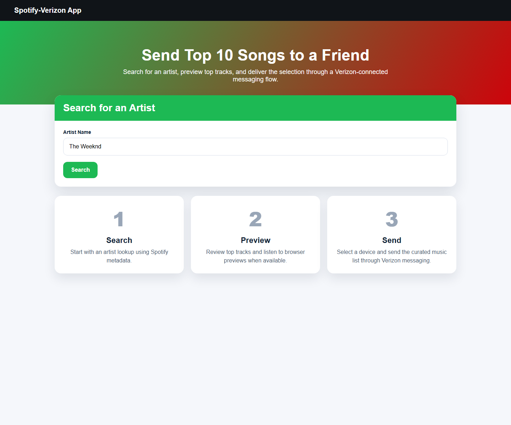
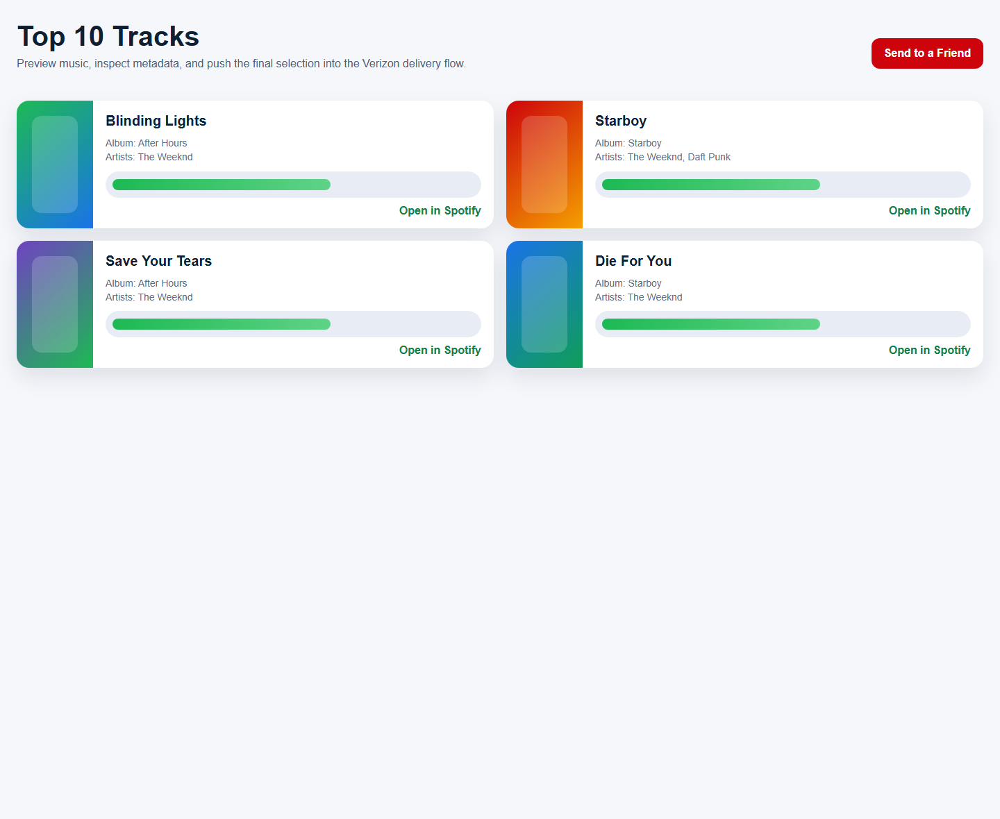

# Spotify-Verizon Integration

A Flask-based web application that connects the Spotify API with Verizon messaging workflows. The app allows a user to search for artists, view top tracks, preview music, and send a selected artist's top songs to a friend through a Verizon-integrated messaging flow.

## Live Demo

- GitHub Pages demo: <https://abubakarshahid16.github.io/Spotify-Frontend-Clone/>

## Visual Preview





## What This Project Does

The application is built around a simple user journey:

1. search for an artist
2. inspect matching search results
3. open the artist's top tracks
4. preview tracks in the browser when previews are available
5. choose a device from the Verizon side
6. send the song list to a friend

This makes the project a good example of API orchestration across two different external services in a user-facing Flask app.

## Core Features

- Spotify integration for artist search and top-track retrieval
- Verizon integration for device discovery and message delivery
- browser-based audio preview support when Spotify preview URLs are available
- multi-step user flow across search, selection, preview, and delivery
- Bootstrap-based responsive UI

## Tech Stack

- Backend: Flask
- External APIs: Spotify API, Verizon API
- Frontend: HTML templates, Bootstrap 5
- Configuration: `.env`-based credentials

## Repository Contents

- `app.py`: main Flask application
- `spotify_utils.py`: Spotify API helper logic
- `verizon_utils.py`: Verizon integration helper logic
- `index.html`, `search_results.html`, `top_tracks.html`, `devices.html`, `success.html`, `error.html`: UI templates
- `.env.example`: sample environment configuration
- `18.04.2025_21.41.52_REC.mp4`: local demo recording preserved in the repository
- `docs/screenshots/`: README preview images for the main user flow

## Setup

### Prerequisites

- Python 3.7+
- Spotify Developer credentials
- Verizon API sandbox access

### Installation

```bash
git clone https://github.com/abubakarshahid16/Spotify-Frontend-Clone.git
cd Spotify-Frontend-Clone

pip install -r requirements.txt
```

### Environment Variables

Create a `.env` file from `.env.example` and set:

```text
SPOTIFY_CLIENT_ID=your-spotify-client-id
SPOTIFY_CLIENT_SECRET=your-spotify-client-secret
VERIZON_API_KEY=your-verizon-api-key
```

### Run

```bash
flask run
```

Open:

```text
http://127.0.0.1:5000
```

## Usage Flow

1. search for an artist on the landing page
2. select an artist from the results
3. inspect the top 10 tracks
4. choose to send the list
5. select a Verizon-connected device
6. confirm delivery

## Development Note

For testing without a live Verizon key, set:

```text
SIMULATE_VERIZON_SUCCESS=true
```

This helps validate the end-to-end user flow during development.

## Demo Asset

- Local walkthrough recording preserved in the repo:
  - `18.04.2025_21.41.52_REC.mp4`

## Why This Project Matters

This project is a useful portfolio piece because it demonstrates:

- integration between multiple third-party APIs
- stateful multi-page application flow
- practical Flask application design
- external credential handling
- user-facing product thinking beyond a single endpoint demo

## Author

Abubakar Shahid  
GitHub: <https://github.com/abubakarshahid16>
